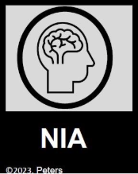
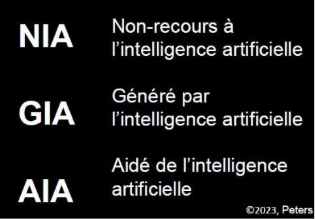
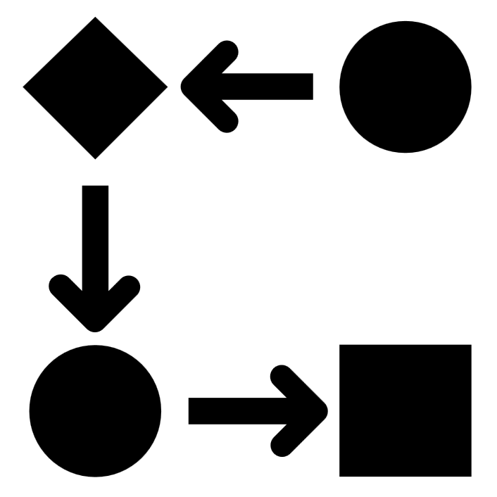
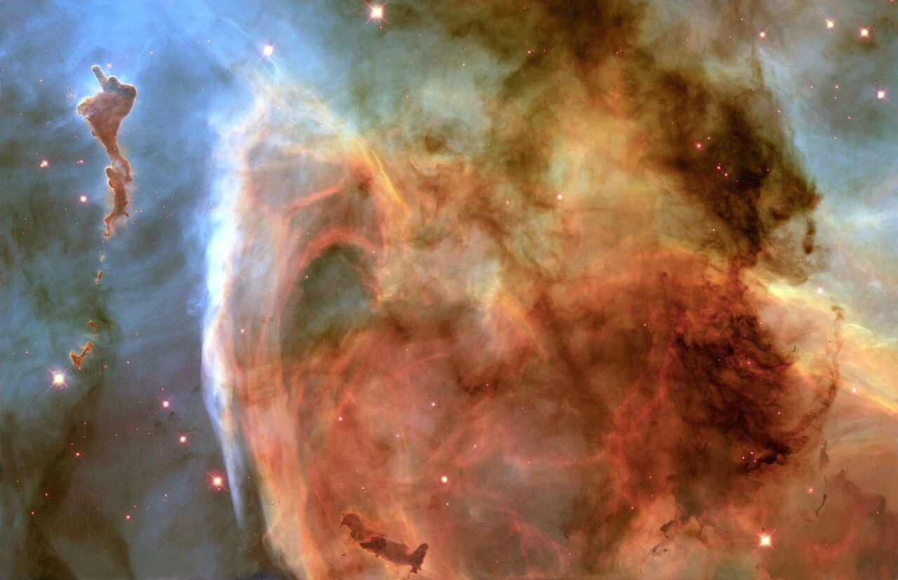

# Vision

Bienvenue sur le hub UniLaSalle Amiens - PAUC dédié aux enseignements de la vision par ordinateur.

Le site est en cours de construction, si vous constatez des erreurs ou des informations qui ne sont plus à jour, veuillez les signaler à l'adresse suivante : thomas.fiolet@unilasalle.fr

## INFORMATIONS GENERALES

-   __REGLES DU LABORATOIRE__

    

    
[Règles de sécurité](secu/securite.md){.md-button_fixed}
    
[Règles de rangement](secu/rangement.md){.md-button_fixed}
    
[Règles sur les livrables](secu/redaction.md){.md-button_fixed}

-   __ORGANISATION DES COURS__

    

    
[Organisation des cours](organisation/organisation.md){.md-button_fixed}
    
[Compétences et prérequis](organisation/competences.md){.md-button_fixed}
    
[IA Probibée](organisation/ia_prohibee.md){.md-button_fixed}

## COURS

-   __PLACEHOLDER__

    

    
[Formats](class/CH1_Formats/CH1_Formats.md){.md-button_fixed}
    
[Opérations](class/CH2_Operations/CH2_Operations.md){.md-button_fixed}
    
[placeholder](){.md-button_fixed}
    
[placeholder](){.md-button_fixed}

-   __PLACEHOLDER__

    

    
[placeholder](){.md-button_fixed}
    
[placeholder](){.md-button_fixed}
    
[placeholder](){.md-button_fixed}
    
[placeholder](){.md-button_fixed}

## TRAVAUX THEORIQUES

-   __PLACEHOLDER__

    

    
[placeholder](){.md-button_fixed}
    
[placeholder](){.md-button_fixed}
    
[placeholder](){.md-button_fixed}
    
[placeholder](){.md-button_fixed}

-   __PLACEHOLDER__

    

    
[placeholder](){.md-button_fixed}
    
[placeholder](){.md-button_fixed}
    
[placeholder](){.md-button_fixed}
    
[placeholder](){.md-button_fixed}
    

## TRAVAUX APPLIQUES

-   __PLACEHOLDER__

    

    
[placeholder](){.md-button_fixed}
    
[placeholder](){.md-button_fixed}
    
[placeholder](){.md-button_fixed}
    
[placeholder](){.md-button_fixed}

-   __PLANIFICATION DE TRAJECTOIRE__

    

    
[placeholder](){.md-button_fixed}
    
[placeholder](){.md-button_fixed}
    
[placeholder](){.md-button_fixed}
    
[placeholder](){.md-button_fixed}

## TUTORIELS

-   __PLACEHOLDER__

    

    
[placeholder](){.md-button_fixed}
    
[placeholder](){.md-button_fixed}
    
[placeholder](){.md-button_fixed}
    
[placeholder](){.md-button_fixed}

-   __PLANIFICATION DE TRAJECTOIRE__

    

    
[placeholder](){.md-button_fixed}
    
[placeholder](){.md-button_fixed}
    
[placeholder](){.md-button_fixed}
    
[placeholder](){.md-button_fixed}

## RESSOURCES

### Livres
📖 [Robotics - T. Bajd, M. Mihelj, J. Lenarcic, A. Stanovnik & M. Munih - (2010)](bib/robotics_bajd.pdf){:download}

📖 [Robots - John M. Jordan - The MIT Press (2016)](bib/robots_jordan.pdf){:download}

📖 [Modern Robotics - Mechanics, Planning, and Control - Frank C. Park & Kevin M. Lynch (2017)](bib/modern_robo.pdf){:download}

📖 [Probabilistic Robotics - Sebastian Thrun, Wolfram Burgard, Dieter Fox (2005)](bib/proba_robo.pdf){:download}

### Supports de cours
📓 [Robotique-Vision - Thomas Fiolet (WIP)](bib/robotique_vision.pdf){:download}

📓 [Robotique et cobotique](bib/robo_cobo.pdf){:download}

📓 [Robotique Industrielle - Mehdi Cherif](bib/robo_cobo.pdf){:download}

📓 [Robotique Mobile - David Fillat (2016)](bib/mobile_fillat.pdf){:download}

📓 [Stéréovision - Généralités & géométrie épipolaire - Sebastien Kramm (2016)](bib/stereo_kramm.pdf){:download}

📓 [Vision Algorithms for Mobile Robotics - Lecture 03 - Camera Calibration - Davide Scaramuzza](bib/vis_alg.pdf){:download}

### Articles
📄 [A new geometric notation for open and closed-loop robots - Khalil & Kleinfinger (1986)](bib/khalil_klein.pdf){:download}

📄 [Rapidly-Exploring Random Trees: A New Tool for Path Planning - Steven M. LaValle (1998)](bib/RRT_lavalle.pdf){:download}

### Vidéos
🎞️ [Cours de Robotique - Jacques Gangloff (2016)](https://www.youtube.com/playlist?list=PLMXdciyMZwAAUlCQ_9mVs_CqQ9YaRTptX)

<!-- **Sélectionnez un cours:**

-   :material-robot:{ .lg .middle } __Cours General de Robotique__

    ---

    Découvrez les technologies robotiques modernes et leurs applications dans l'industrie, avec un focus sur la programmation et l’automatisation des tâches complexes. 
    
[Lire le cours](./class/robotique-vision.md){.md-button}

- :material-factory:{ .lg .middle } __Projet Robotique sous 3D Experience__

    ---

    Plongez dans l’univers de la digitalisation des usines, de la simulation des processus à l'intégration des outils de production intelligente à travers le logiciel 3DExperience. 
    
[Lire le cours](./class/Projet_robotique_3DExp.md){.md-button}

 -->